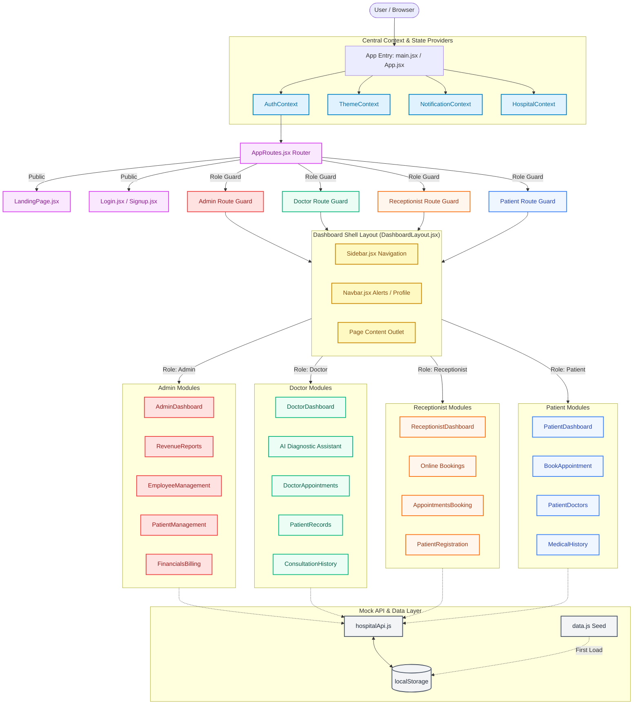

# CurePulse - Smart Hospital Management System

A full-featured hospital management dashboard built with React 19, Vite 8, and Tailwind CSS v4. Supports four roles — Admin, Doctor, Receptionist, and Patient — each with a tailored interface.

> **Note:** This is a frontend-only demo. All data is stored in `localStorage` using a simulated mock API.

---

## Core Technology Stack

| Technology | Purpose |
|---|---|
| **React 19 + Vite 8** | UI library with Hot Module Replacement |
| **React Router Dom 7** | Client-side routing with role guard middleware |
| **Framer Motion 12** | Animations, layout animations, modal overlays, page transitions |
| **Recharts 3** | Interactive area, bar, line, pie, and radar chart visualization |
| **React Icons** | Feather icon set |
| **Vanilla CSS + Tailwind v4** | Glassmorphism, responsive grids, dark/light hybrid modes |
| **jsPDF + autoTable + html2canvas** | PDF report generation with text and canvas-based exports |
| **@react-oauth/google** | Google OAuth implicit flow sign-in |
| **react-hot-toast** | Toast notification system |
| **Lenis** | Smooth scrolling for landing page |

---

## Role-Based Portals & Features

The system supports four distinct user authentication roles with specific route-guarded permissions:

### 🏥 Patient Portal
- **Dashboard** (`/patient/dashboard`): Vitals chart, upcoming appointments, emergency request, billing summary.
- **Book Appointment** (`/patient/book-appointment`): Schedule with department/doctor/date/time selection.
- **My Doctors** (`/patient/my-doctors`): View assigned doctors and appointment history per doctor.
- **Medical History** (`/patient/medical-history`): Vitals history, prescriptions, billing history.
- **Billing** (`/patient/billing`): Invoice list with download/print.
- **Emergency Assistance**: Request emergency dispatch from dashboard.

### 🥼 Doctor Portal
- **Dashboard** (`/doctor/dashboard`): Appointment queue, AI Diagnostic Assistant (3-tab panel: AI Diagnosis, Smart Prescribing, Clinical Summarization), assigned patients, bed occupancy.
- **Appointments** (`/doctor/appointments`): Accept/reject/complete appointments with status transitions.
- **Patient Records** (`/doctor/patients`): Search patients, view details, add prescriptions.
- **Consultation History** (`/doctor/consultations`): Browse past consultations with PDF report generation and clickable patient IDs.
- **Profile** (`/doctor/profile`): Performance stats, ratings breakdown, schedule, patient reviews.

### 🛎️ Receptionist Portal
- **Dashboard** (`/receptionist/dashboard`): Booking mode stats, today's appointments, bed occupancy.
- **Online Bookings** (`/receptionist/online-bookings`): Accept/Reject/Read/Hold actions on online patient bookings with status badges ("New" with pulsing indicator), per-button loading spinners.
- **Patient Registration** (`/receptionist/patients`): Register new patients with document upload fields.
- **Appointment Booking** (`/receptionist/appointments`): Walk-in/phone appointment scheduling.
- **Admission & Discharge** (`/receptionist/admissions`): Track admissions, discharges, bed map.

### 👑 Administrator Portal
- **Dashboard** (`/admin/dashboard`): Revenue charts, bed occupancy, activity feed, COVID stats, emergency alerts.
- **Patient Management** (`/admin/patients`): CRUD, search, filter, pagination.
- **Doctor Management** (`/admin/doctors`): Add, update, remove doctor profiles with detail modals.
- **Staff Scheduling** (`/admin/schedule`): Weekly schedule grid with filters and modals.
- **Financials & Billing** (`/admin/financials`): Invoice management, payment tracking.
- **Revenue Reports** (`/admin/revenue`): Landscape PDF export, animated Revenue over Time chart with Monthly/Quarterly toggle (animated sliding indicator), clickable Transaction IDs opening detail modal, department progress bars, collection status, payment method summary.
- **Emergency Dashboard** (`/admin/emergency`): Active alerts, team dispatch, resource allocation.
- **Pharmacy** (`/admin/pharmacy`): Inventory management with stock levels.
- **Analytics** (`/admin/analytics`): Department, appointment, and patient growth charts.
- **Settings** (`/admin/settings`): Hospital info, security, audit logs.

---

## Demo Security Credentials

To preview the portal workspaces, sign in with these demo profiles:

| Role | Email | Password |
|---|---|---|
| Admin | admin@curepulse.com | demo123 |
| Doctor | doctor@curepulse.com | demo123 |
| Receptionist | receptionist@curepulse.com | demo123 |
| Patient | patient@curepulse.com | demo123 |

You can also sign up as a new patient via the Signup page. On signup, a patient record (status "Pending") and an online booking appointment (status "New") are auto-created for the receptionist to process.

---

## Project Architecture

```
hospital-dashboard/
├── public/                  # Static assets
├── src/
│   ├── app/
│   │   └── layouts/         # DashboardLayout, Sidebar, Navbar
│   ├── components/
│   │   ├── charts/          # Recharts wrappers (RevenueChart, DepartmentChart, etc.)
│   │   ├── common/          # Shared UI primitives (Modal, ConfirmDialog, StatCard, Input, Select, Pagination, BedOccupancyPanel, ClinicalNotesCard, ActionMenu, EmptyState, ActivityFeed, etc.)
│   │   └── details/         # Detail modals (PatientDetailModal, DoctorDetailModal, AppointmentDetailModal, EditPatientModal)
│   ├── context/             # React Context providers:
│   │   ├── AuthContext.jsx      # Login/logout/signup, Google OAuth, rate limiting
│   │   ├── ThemeContext.jsx     # Dark/light mode toggle
│   │   ├── HospitalContext.jsx  # Global state: patients, doctors, appointments, billing, inventory, etc.
│   │   └── NotificationContext.jsx  # In-app notification feed
│   ├── lib/                 # Formatter utilities (formatInr, formatDate, formatCompactInr)
│   ├── mock/                # Database seed (data.js)
│   ├── modules/             # Domain-driven feature modules:
│   │   ├── admin/           # EmployeeManagement, RevenueReports, Financials, Settings, etc.
│   │   ├── appointments/    # BookAppointment, AppointmentsBooking, DoctorAppointments
│   │   ├── auth/            # Login, Signup
│   │   ├── billing/         # BillingDashboard
│   │   ├── dashboard/       # Role-specific dashboards (admin/, doctor/, patient/, receptionist/)
│   │   ├── doctors/         # DoctorManagement, DoctorProfile, ConsultationHistory, StaffSchedule
│   │   ├── emergency/       # EmergencyDashboard
│   │   ├── landing/         # Landing page sections (Hero, Features, FAQ, Testimonials, etc.)
│   │   ├── patients/        # PatientManagement, PatientRecords, MedicalHistory, PatientRegistration
│   │   ├── pharmacy/        # Pharmacy management
│   │   └── receptionist/    # ReceptionistPatients, ReceptionistOnlineBookings, AdmissionDischarge
│   ├── routes/              # AppRoutes with ProtectedRoute role guards, lazy-loaded routes
│   ├── services/            # hospitalApi.js (simulated REST), rateLimiter.js
│   ├── App.jsx              # Bootstrapping with Context providers + GoogleOAuthProvider
│   └── main.jsx             # Entry point
├── index.html
├── vite.config.js           # Vite bundler config
├── eslint.config.js         # ESLint rules
└── package.json             # Dependencies & scripts
```

---

## Installation & Getting Started

### Prerequisites

- **Node.js** >= 18
- **npm** >= 9

### Install & Run

```bash
# Navigate to project directory
cd hospital-dashboard

# Install dependencies
npm install

# Start development server (Hot Module Replacement)
npm run dev
```

The app will be available at `http://localhost:5173` (or the next available port).

### Google OAuth Setup (Optional)

1. Create a project at [Google Cloud Console](https://console.cloud.google.com/)
2. Enable the Google+ API and create OAuth 2.0 credentials (Web application)
3. Add `http://localhost:5173` to Authorized JavaScript origins
4. Copy the Client ID and set it in `.env`:

```
VITE_GOOGLE_CLIENT_ID=your_client_id_here
```

Without a valid Client ID, the Google Sign-In button falls through gracefully to an error message.

### Build for Production

```bash
npm run build
npm run preview   # Preview production build locally
```

### Static Code Linting

```bash
npm run lint
```

---

## Available Scripts

| Command | Description |
|---|---|
| `npm run dev` | Start Vite dev server with HMR |
| `npm run build` | Build for production |
| `npm run preview` | Preview production build |
| `npm run lint` | Run ESLint |

---

## System Architecture & Flow

The visual flow diagram below illustrates the CurePulse Smart Hospital Management System's structural layout, routing flow, state providers, and storage integration:



### Data Flow

```mermaid
graph TD
    A[User Browser] -->|Request Route| B[React Router]
    B -->|Intercept| C{ProtectedRoute}
    H[AuthContext] -.->|Session Check| C
    C -->|Unauthorized| D[/login]
    C -->|Authorized| E[DashboardLayout]
    E --> F[Sidebar & Navbar]
    E --> G[View Component]
    I[HospitalContext] -.->|Data & CRUD| G
    J[ThemeContext] -.->|Dark/Light| E
    K[NotificationContext] -.->|Toasts| G
    G -->|CRUD Call| I
    I -->|API Call| L[hospitalApi.js]
    L -->|120-240ms latency| M[simulateRequest]
    M -->|normalizeDb| N[Read/Write]
    N --> O[(localStorage)]
    O -->|Seed if empty| P[mock/data.js]
    L -.->|Audit Log| I
    I -.->|State Update| G
```

---

## Features by Role

### Admin
- Dashboard with revenue charts, bed occupancy, activity feed, emergency alerts
- Patient management (CRUD, search, filter, pagination)
- Doctor & employee management with detail modals
- Staff scheduling with weekly grid and filters
- Financials & billing management
- **Revenue Reports**: Landscape PDF export, animated Monthly/Quarterly toggle, transaction detail modal, department progress bars, payment method summary
- Pharmacy inventory management
- Emergency dashboard with team dispatch
- Analytics with department/appointment/patient growth charts
- Hospital settings & audit logs

### Doctor
- Dashboard with appointment queue, assigned patients, bed occupancy
- **AI Diagnostic Assistant**: 3-tab panel — AI Diagnosis (symptom analysis), Smart Prescribing, Clinical Summarization
- View & manage appointments (accept/reject/complete)
- Patient records & medical history with prescription entry
- Consultation history with PDF report generation and clickable patient IDs
- Doctor profile with performance metrics, ratings breakdown, reviews

### Receptionist
- Dashboard with booking mode stats, today's appointments, bed occupancy
- **Online Booking Management**: Accept/Reject/Read/Hold actions, "New" status badge with pulse animation, per-button loading spinners
- Appointment booking (walk-in/phone)
- Patient registration with document upload
- Admission & discharge tracking with bed map

### Patient
- Dashboard with vitals chart, upcoming appointments, emergency dispatch
- Book appointments with department/doctor/date/time selection
- View assigned doctors & appointment history per doctor
- Medical history (vitals trends, prescriptions, billing history)
- Billing summary with invoice download/print
- Emergency assistance dispatch from dashboard

---

## License

This project was created as part of an academic assignment (React Task).
