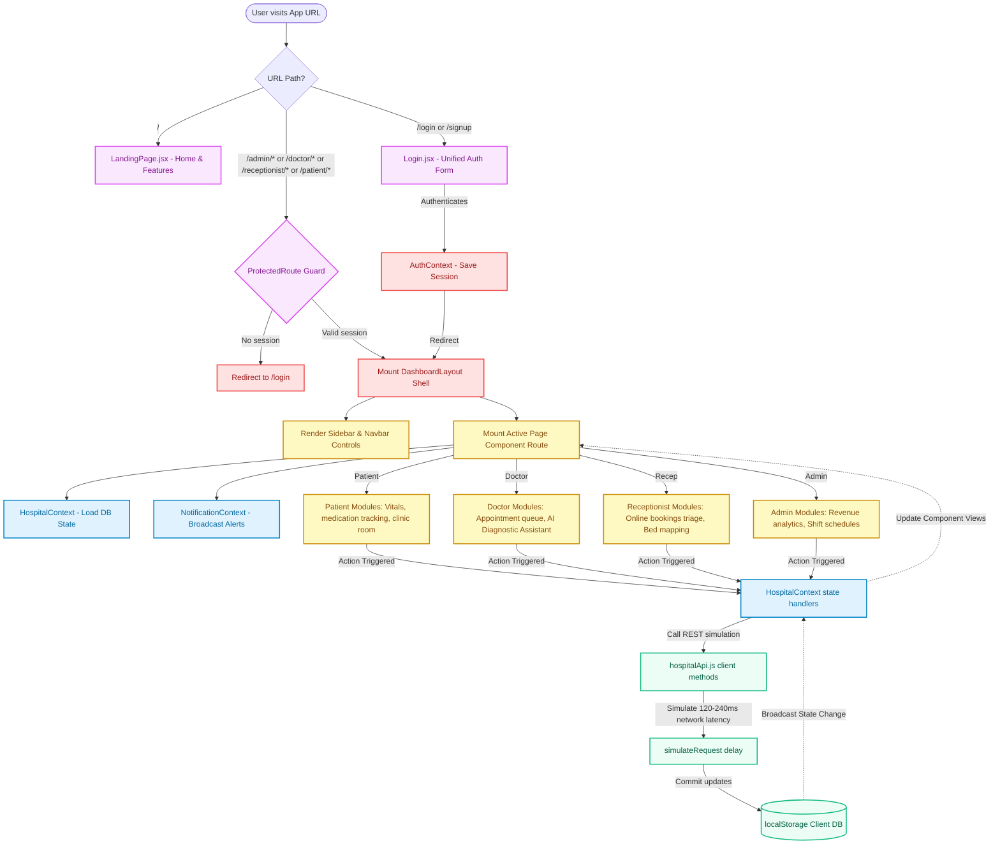

# CurePulse - Smart Hospital Management System

CurePulse is a premium hospital management dashboard built with **React 19**, **Vite 8**, and **Tailwind CSS v4**. It simulates real-time data flow for four distinct user roles, persisting all changes directly to browser `localStorage`.

---

## 🔑 Quick Demo Credentials

Log in with any of the demo profiles below:

| Role | Email | Password | Access Area |
|---|---|---|---|
| **Admin** | `admin@curepulse.com` | `demo123` | Full control: revenue, scheduling, inventory |
| **Doctor** | `doctor@curepulse.com` | `demo123` | Patients list, appointments, AI Diagnostic Assistant |
| **Receptionist** | `receptionist@curepulse.com` | `demo123` | Manage online bookings, registrations, admissions |
| **Patient** | `patient@curepulse.com` | `demo123` | Live telemetry, medication tracking, clinic room |

*Note: You can also register a new patient account using the **Sign Up** tab on the login screen.*

---

## ⚡ Quick Start

### Prerequisites
- **Node.js** >= 18.0.0
- **npm** >= 9.0.0

### Run the App
```bash
# 1. Install dependencies
npm install

# 2. Start the hot-reloading dev server
npm run dev

# 3. Build for production compilation
npm run build
```
Once started, the application runs locally at `http://localhost:5173`.

---

## 🌟 Key Workspaces

- **🏥 Patient Portal**: Check daily pill compliance, symptom checkers, telehealth clinics, relative ECG monitors, and doctor lookup.
- **🥼 Doctor Portal**: View appointments queue, log patient prescriptions, and use the AI clinical summaries and prescription assistants.
- **🛎️ Receptionist Portal**: Fast check-in walk-ins, triage online appointment requests, and manage bed maps.
- **👑 Admin Portal**: Track financial revenue collections, adjust staff shifts, review audit logs, and dispatch emergency alerts.

---

## 📁 Key File Structure

```
src/
├── app/layouts/      # Global Layout Shells (Sidebar, Navbar, Dashboard shell)
├── context/          # React State Providers (Auth, Theme, Hospital Data, Notifications)
├── modules/          # Feature Pages (Dashboard views, login screen panels, landing)
├── routes/           # Router configurations and role-based route guards
└── services/         # Mock API (persists data with 120-240ms network latency simulation)
```

---

## 🔄 Core Project Flow & Architecture

CurePulse utilizes a reactive, client-side data architecture. The detailed flow diagram below traces a user's request lifecycle from the initial router hits to context data binding and local storage commits:



### Detailed Flow Explanation:

1. **Routing & Authentication Guarding (`AppRoutes.jsx`)**:
   - Every page request is triaged by React Router. Public routes (`/`, `/login`, `/signup`) render without credentials.
   - Protected paths (e.g. `/patient/*`, `/admin/*`) pass through `<ProtectedRoute>`. If no session is active in `AuthContext`, the user is immediately redirected to `/login`.
   
2. **Layout Shell Rendering (`DashboardLayout.jsx`)**:
   - Once validated, the layout shell mounts. It initializes the `Sidebar` and `Navbar` with the user's role-based links and displays the sub-route component inside the `<Outlet />` area.

3. **Global State Synchronization (`HospitalContext.jsx`)**:
   - The active component binds directly to `HospitalContext` to access global entities (patients list, active appointments, financials, beds occupancy data).
   - Any client action (e.g., admitting a patient, saving a prescription, logging a medication) invokes a handler inside `HospitalContext`.

4. **Simulated REST Client & Persistence (`hospitalApi.js`)**:
   - Context handlers call `hospitalApi.js` REST simulation methods.
   - The API client wraps CRUD operations inside an asynchronous `simulateRequest` wrapper, which adds a mock network delay of **120-240ms** before reading or writing data.
   - All finalized data changes are committed directly to the browser's `localStorage` (under the key `curepulse_hospital_db_v3`), keeping changes persisted across page reloads.


---

## 🔄 Core Project Workflows

Here is the operational workflow path for each of the four role actors:

```mermaid
graph TD
    Start([User Landing Page]) --> Select{Choose Portal}
    Select -->|Sign In / Sign Up| Auth[Unified login/signup screen]
    
    Auth -->|Role: Patient| P_Flow[Patient Workflow]
    Auth -->|Role: Doctor| D_Flow[Doctor Workflow]
    Auth -->|Role: Receptionist| R_Flow[Receptionist Workflow]
    Auth -->|Role: Admin| A_Flow[Admin Workflow]

    subgraph P_Flow ["Patient Operations"]
        P1[Dashboard Vitals] --> P2[Book Appointment]
        P2 --> P3[Check Medication Taken]
        P3 --> P4[AI Symptom Checker]
        P4 --> P5[Virtual Clinic Video Consult]
    end

    subgraph D_Flow ["Doctor Operations"]
        D1[Appointment Queue] --> D2[AI Diagnostic Assistant]
        D2 --> D3[Smart Prescribing]
        D3 --> D4[Save Consultation PDF]
    end

    subgraph R_Flow ["Receptionist Operations"]
        R1[Online Bookings Triage] --> R2[Confirm/Reject Booking]
        R2 --> R3[Walk-in Registration]
        R3 --> R4[Assign Available Bed]
    end

    subgraph A_Flow ["Admin Operations"]
        A1[Track Financial Revenue] --> A2[Doctor Shift Scheduling]
        A2 --> A3[Pharmacy Stock Levels]
        A3 --> A4[Active Emergency Alerts]
    end
```



