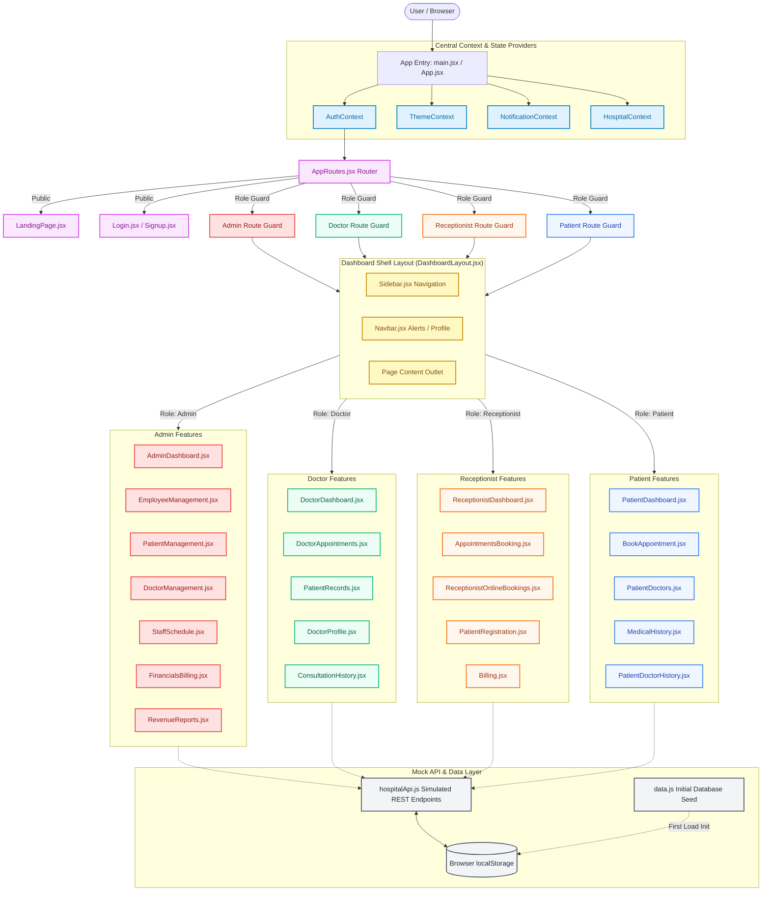
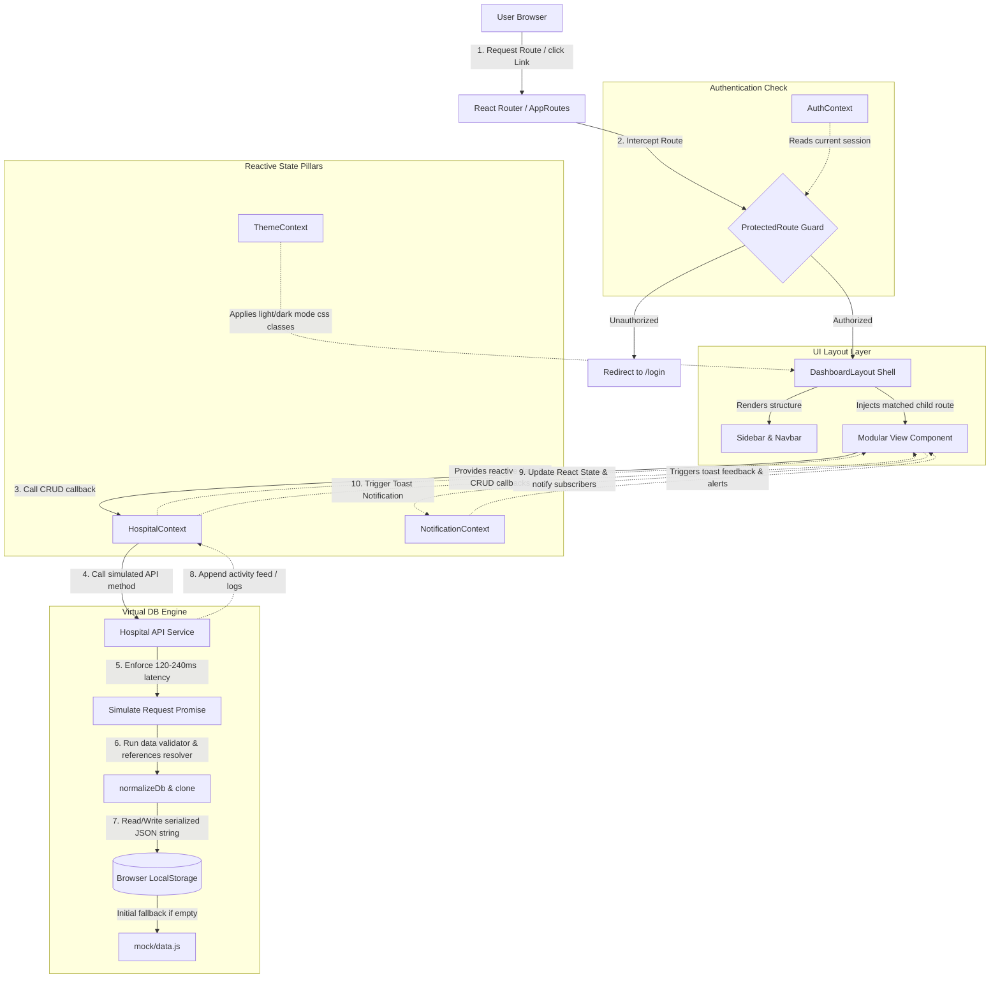

# CurePulse - Smart Hospital Management System

A full-featured hospital management dashboard built with React, Vite, and Tailwind CSS v4. Supports four roles — Admin, Doctor, Receptionist, and Patient — each with a tailored interface.

> **Note:** This is a frontend-only demo. All data is stored in `localStorage` using a simulated mock API.

---

## Tech Stack

| Technology        | Purpose                     |
| ----------------- | --------------------------- |
| React 19          | UI library                  |
| Vite 8            | Build tool & dev server     |
| Tailwind CSS v4   | Utility-first CSS framework |
| Framer Motion     | Animations & transitions    |
| React Router v7   | Client-side routing         |
| Recharts          | Charts & graphs             |
| jsPDF + autoTable | PDF report generation       |
| react-hot-toast   | Toast notifications         |
| react-icons       | Icon library                |

---

## System Architecture & Flow

The visual flow diagram below illustrates the CurePulse Smart Hospital Management System's structural layout, routing flow, state providers, and storage integration:



---

## Features by Role

### Admin
- Dashboard with revenue charts, bed occupancy, activity feed
- Patient management (CRUD, search, filter, pagination)
- Doctor & employee management
- Staff scheduling with filters & modals
- Financials & revenue reports with PDF export
- Pharmacy inventory management
- Emergency dashboard with alerts & team dispatch
- Detailed analytics & statistics reports
- Hospital settings & audit logs

### Doctor
- Dashboard with appointment stats & assigned patients
- View & manage appointments (accept/reject/complete)
- Patient records & medical history
- Consultation history with PDF report generation
- Doctor profile with performance metrics

### Receptionist
- Dashboard with booking mode stats & today's appointments
- Patient registration with document upload
- Appointment booking (walk-in/phone)
- Online booking management
- Admission & discharge tracking with bed map
- Patient lookup & billing

### Patient
- Dashboard with vitals chart & upcoming appointments
- Book appointments with department/doctor selection
- View assigned doctors & appointment history
- Medical history (vitals, prescriptions, billing)
- Billing summary

---

## Project Structure

```
hospital-dashboard/
├── index.html                  # HTML entry point
├── vite.config.js              # Vite configuration
├── eslint.config.js            # ESLint flat config
├── package.json                # Dependencies & scripts
├── public/
│   ├── favicon.svg             # CurePulse logo favicon
│   └── icons.svg               # SVG sprite icons
└── src/
    ├── main.jsx                # React entry point
    ├── App.jsx                 # Root component (providers + routing)
    ├── index.css               # Tailwind v4 + custom theme
    ├── app/
    │   └── layouts/
    │       ├── DashboardLayout.jsx   # Shell layout (Sidebar + Navbar + Outlet)
    │       ├── Navbar.jsx            # Top navigation bar
    │       └── Sidebar.jsx           # Role-based collapsible sidebar
    ├── routes/
    │   └── AppRoutes.jsx             # Route definitions with protected routes
    ├── context/
    │   ├── AuthContext.jsx           # Authentication state & mock login
    │   ├── ThemeContext.jsx          # Dark/light theme toggle
    │   ├── NotificationContext.jsx   # In-app notification system
    │   └── HospitalContext.jsx       # Central data store
    ├── services/
    │   └── hospitalApi.js           # Mock REST API (localStorage-backed)
    ├── hooks/
    │   └── useDebouncedValue.js     # Debounce utility hook
    ├── lib/
    │   ├── formatters.js            # INR currency & date formatting
    │   ├── search.js                # Search & match utilities
    │   └── fileAttachments.js       # File reading & size formatting
    ├── mock/
    │   └── data.js                  # Initial seed data
    ├── components/
    │   ├── common/                  # Reusable UI components
    │   │   ├── Modal.jsx
    │   │   ├── EmptyState.jsx
    │   │   ├── ConfirmDialog.jsx
    │   │   ├── ActionMenu.jsx
    │   │   ├── StatCard.jsx
    │   │   ├── LoadingSkeleton.jsx
    │   │   └── ActivityFeed.jsx
    │   ├── details/                 # Detail view modals
    │   │   ├── PatientDetailModal.jsx
    │   │   ├── DoctorDetailModal.jsx
    │   │   └── AppointmentDetailModal.jsx
    │   ├── documents/               # Document upload & display
    │   │   ├── DocumentUploader.jsx
    │   │   └── DocumentList.jsx
    │   └── charts/                  # Chart components
    │       ├── RevenueChart.jsx      # Bar chart (revenue vs expenses)
    │       └── DepartmentChart.jsx   # Donut chart (department distribution)
    └── modules/                     # Page modules grouped by feature
        ├── auth/
        │   ├── Login.jsx
        │   └── Signup.jsx
        ├── dashboard/
        │   ├── admin/AdminDashboard.jsx
        │   ├── doctor/DoctorDashboard.jsx
        │   ├── receptionist/ReceptionistDashboard.jsx
        │   └── patient/PatientDashboard.jsx
        ├── patients/
        │   ├── PatientManagement.jsx
        │   ├── PatientRegistration.jsx
        │   ├── PatientRecords.jsx
        │   ├── MedicalHistory.jsx
        │   ├── PatientDoctors.jsx
        │   └── PatientDoctorHistory.jsx
        ├── appointments/
        │   ├── BookAppointment.jsx
        │   ├── AppointmentsBooking.jsx
        │   └── DoctorAppointments.jsx
        ├── doctors/
        │   ├── DoctorManagement.jsx
        │   ├── DoctorProfile.jsx
        │   ├── StaffSchedule.jsx
        │   ├── ConsultationHistory.jsx
        ├── admin/
        │   ├── EmployeeManagement.jsx
        │   ├── FinancialsBilling.jsx
        │   └── RevenueReports.jsx
        ├── billing/
        │   ├── Billing.jsx
        │   └── BillingDashboard.jsx
        ├── pharmacy/
        │   └── PharmacyInventory.jsx
        ├── emergency/
        │   └── EmergencyDashboard.jsx
        ├── receptionist/
        │   ├── ReceptionistPatients.jsx
        │   ├── ReceptionistOnlineBookings.jsx
        │   └── AdmissionDischarge.jsx
        └── settings/
            └── SettingsModule.jsx
```

---

## Getting Started

### Prerequisites

- **Node.js** >= 18
- **npm** >= 9

### Install & Run

```bash
# Navigate to project directory
cd hospital-dashboard

# Install dependencies
npm install

# Start development server
npm run dev
```

The app will be available at `http://localhost:5173` (or the next available port).

### Build for Production

```bash
npm run build
npm run preview   # Preview production build locally
```

---

## Demo Credentials

All accounts use password: **`demo123`**

| Role         | Email                     |
| ------------ | ------------------------- |
| Admin        | admin@curepulse.com       |
| Doctor       | doctor@curepulse.com      |
| Receptionist | receptionist@curepulse.com|
| Patient      | patient@curepulse.com     |

You can also sign up as a new patient via the Signup page.

---

## Available Scripts

| Command            | Description                          |
| ------------------ | ------------------------------------ |
| `npm run dev`      | Start Vite dev server                |
| `npm run build`    | Build for production                 |
| `npm run preview`  | Preview production build             |
| `npm run lint`     | Run ESLint                           |

---

## Key Libraries Used

| Library            | Version | Usage                             |
| ------------------ | ------- | --------------------------------- |
| framer-motion      | ^12.40  | Page transitions, modal animations|
| jspdf              | ^4.2    | PDF report generation             |
| jspdf-autotable    | ^5.0    | PDF table formatting              |
| react-hot-toast    | ^2.6    | Toast/snackbar notifications      |
| react-icons        | ^5.6    | Icon set                          |
| recharts           | ^3.8    | Charts (bar, line, pie, donut)    |

---

## Project Architecture & System Flow

### System Flow Diagram

The following diagram illustrates how user actions and requests flow through the CurePulse system, showing the interaction between security route guards, global state managers (Contexts), individual UI components, the simulated API layer, and the LocalStorage database engine:



---

### Deep Dive: The 5 Core Structures Explained (Human Perspective)

To help developers understand the CurePulse engineering design, here is a detailed breakdown of the 5 core structural pillars of this application:

#### 1. Security & Routing Architecture ([AppRoutes.jsx](file:///d:/AIT%20bengaluru/react_manget_project/hospital-dashboard/src/routes/AppRoutes.jsx))
CurePulse secures views using **Client-Side Role-Based Guards** implemented via React Router v7.

* **The Security Interceptor (`ProtectedRoute`)**: At the core of our security layout is the `ProtectedRoute` component. When a page transition occurs, `ProtectedRoute` checks the active session stored inside [AuthContext.jsx](file:///d:/AIT%20bengaluru/react_manget_project/hospital-dashboard/src/context/AuthContext.jsx). If no user is logged in, it redirects the browser to `/login`.
* **Role Hijacking Prevention**: If a user is logged in but tries to access a page they don't have access to (for example, a patient trying to access `/admin/dashboard`), the route guard intercepts the action. It checks `user.role` against the route's `allowedRole` parameter. If they mismatch, the guard automatically redirects the user back to their designated role dashboard (e.g., `/patient/dashboard`).
* **Nested Outlets and Shell Layouts**: We organize our routes into logical role groups (`/admin`, `/doctor`, `/receptionist`, `/patient`). Each role group shares a single parent route that renders [DashboardLayout.jsx](file:///d:/AIT%20bengaluru/react_manget_project/hospital-dashboard/src/app/layouts/DashboardLayout.jsx) wrapped inside a `ProtectedRoute`. The individual dashboard pages are defined as child sub-routes and are injected dynamically using React Router's `<Outlet />` component, which keeps code clean and modular.

---

#### 2. Shared State Coordination & Context Pillars (`src/context/`)
Rather than relying on heavy external state-management libraries like Redux or Zustand, CurePulse uses React's native Context API. We maintain four dedicated contexts that handle specific segments of the application state:

* **[AuthContext.jsx](file:///d:/AIT%20bengaluru/react_manget_project/hospital-dashboard/src/context/AuthContext.jsx)**: Handles login, logout, registration, and sessions. It stores user credentials, validates passwords against the database, and exposes the `user` state globally.
* **[HospitalContext.jsx](file:///d:/AIT%20bengaluru/react_manget_project/hospital-dashboard/src/context/HospitalContext.jsx)**: This is the operational engine of the frontend. It holds all patients, appointments, billing invoices, inventory data, settings, and doctor records in React state. Whenever a dashboard component performs a CRUD operation (e.g., adding a doctor or editing a patient's vitals), it invokes a callback function exposed by this context (such as `addDoctor` or `updatePatient`), which updates the backend storage and forces state synchronization.
* **[ThemeContext.jsx](file:///d:/AIT%20bengaluru/react_manget_project/hospital-dashboard/src/context/ThemeContext.jsx)**: Manages dark and light modes. It listens to user selections, toggles CSS theme variables on the root document element, and persists the theme preference in local storage.
* **[NotificationContext.jsx](file:///d:/AIT%20bengaluru/react_manget_project/hospital-dashboard/src/context/NotificationContext.jsx)**: An in-app notification context that enables role-specific notification alerts. It formats and serves real-time events (like emergency dispatches, pending appointments, and system alerts) in a vertical feed.

---

#### 3. Data Simulation & Database Layer ([hospitalApi.js](file:///d:/AIT%20bengaluru/react_manget_project/hospital-dashboard/src/services/hospitalApi.js))
Because CurePulse is a client-side prototype, we designed a simulated backend API and database layer that runs entirely in the browser:

* **Mock Database Engine**: Initial data is loaded from [data.js](file:///d:/AIT%20bengaluru/react_manget_project/hospital-dashboard/src/mock/data.js) (which acts as our database seed). The database is written and stored as a stringified JSON object in `localStorage` under the key `curepulse_hospital_db_v2`.
* **Strict Normalization (`normalizeDb`)**: To simulate a relational database, `hospitalApi.js` features a custom ORM/validator called `normalizeDb`. This function runs on every read and write operation. It builds relational lookups between patients and their assigned doctors, calculates billing statuses, links appointments to doctor fee structures, compiles patient clinical history, and dynamically updates dashboard charts. For example, if you change a doctor's age or specialization, `normalizeDb` ensures that those changes cascade to every patient detail view, appointment summary, and dashboard widget referencing that doctor.
* **Data Isolation and Reference Safety**: To prevent accidental state mutation (a common source of bugs in React), we use JSON serialization (`JSON.parse(JSON.stringify(db))`) to clone all data before reading from or writing to the storage. This ensures that frontend components work with clean copies and cannot directly mutate the database in memory without calling the API wrapper.
* **Simulated Network Latency**: To mimic a real production environment, all API actions are wrapped in an asynchronous promise runner (`simulateRequest`) that injects a simulated network delay of 120ms to 240ms. This allows developer testing of loading spinners, skeleton UI screens, and form submit button disabled states.
* **Audit Logging and Activity Tracking**: The API features automated side-effects, such as appending entries to `settings.auditLogs` (tracking administrative changes like doctor creations, patient updates, and password changes) and `activityFeed` (triggering live dashboard events).

---

#### 4. Domain-Driven Modular Organization (`src/modules/`)
Instead of separating files strictly by technical type (e.g., all components in one folder, all pages in another), CurePulse follows a domain-driven directory structure under `src/modules/`. This makes the codebase easy to maintain because all code relating to a business capability is kept in one place:

* **[auth/](file:///d:/AIT%20bengaluru/react_manget_project/hospital-dashboard/src/modules/auth)**: Contains login and patient signup modules.
* **[dashboard/](file:///d:/AIT%20bengaluru/react_manget_project/hospital-dashboard/src/modules/dashboard)**: Contains the landing dashboards tailored specifically for each role:
  - Admin: [AdminDashboard.jsx](file:///d:/AIT%20bengaluru/react_manget_project/hospital-dashboard/src/modules/dashboard/admin/AdminDashboard.jsx)
  - Doctor: [DoctorDashboard.jsx](file:///d:/AIT%20bengaluru/react_manget_project/hospital-dashboard/src/modules/dashboard/doctor/DoctorDashboard.jsx)
  - Receptionist: [ReceptionistDashboard.jsx](file:///d:/AIT%20bengaluru/react_manget_project/hospital-dashboard/src/modules/dashboard/receptionist/ReceptionistDashboard.jsx)
  - Patient: [PatientDashboard.jsx](file:///d:/AIT%20bengaluru/react_manget_project/hospital-dashboard/src/modules/dashboard/patient/PatientDashboard.jsx)
* **[patients/](file:///d:/AIT%20bengaluru/react_manget_project/hospital-dashboard/src/modules/patients)**: Manages patient records, intake registrations, diagnosis histories, and medical records.
* **[doctors/](file:///d:/AIT%20bengaluru/react_manget_project/hospital-dashboard/src/modules/doctors)**: Houses [DoctorManagement.jsx](file:///d:/AIT%20bengaluru/react_manget_project/hospital-dashboard/src/modules/doctors/DoctorManagement.jsx) (adding, editing, and displaying doctor info including ages and specialized surgeon roles), [DoctorProfile.jsx](file:///d:/AIT%20bengaluru/react_manget_project/hospital-dashboard/src/modules/doctors/DoctorProfile.jsx), and [StaffSchedule.jsx](file:///d:/AIT%20bengaluru/react_manget_project/hospital-dashboard/src/modules/doctors/StaffSchedule.jsx).
* **[appointments/](file:///d:/AIT%20bengaluru/react_manget_project/hospital-dashboard/src/modules/appointments)**: Handles the calendar scheduling, booking forms, status transitions, and appointment lists.
* **[billing/](file:///d:/AIT%20bengaluru/react_manget_project/hospital-dashboard/src/modules/billing)** & **[admin/](file:///d:/AIT%20bengaluru/react_manget_project/hospital-dashboard/src/modules/admin)**: Manages financials, invoice creation, billing history tracking, and downloadable PDF reports.
* **[pharmacy/](file:///d:/AIT%20bengaluru/react_manget_project/hospital-dashboard/src/modules/pharmacy)** & **[emergency/](file:///d:/AIT%20bengaluru/react_manget_project/hospital-dashboard/src/modules/emergency)**: Specialized sub-systems handling drug inventory and emergency squad dispatches.

---

#### 5. Custom Layouts, Common Components, & CSS Variables Styling ([index.css](file:///d:/AIT%20bengaluru/react_manget_project/hospital-dashboard/src/index.css))
CurePulse uses a modern, premium design system built with Tailwind CSS v4 and vanilla CSS customization:

* **The Shell Layout**: [DashboardLayout.jsx](file:///d:/AIT%20bengaluru/react_manget_project/hospital-dashboard/src/app/layouts/DashboardLayout.jsx) coordinates the screen layout. It connects [Sidebar.jsx](file:///d:/AIT%20bengaluru/react_manget_project/hospital-dashboard/src/app/layouts/Sidebar.jsx) (a collapsible panel containing role-based navigation links, including the new **DR Details** section for admins) with [Navbar.jsx](file:///d:/AIT%20bengaluru/react_manget_project/hospital-dashboard/src/app/layouts/Navbar.jsx) (the top navigation bar hosting search, theme toggles, and notification dropdown panels).
* **Shared UI Widgets (`src/components/`)**: To maximize reuse and ensure consistent design patterns, common UI widgets are extracted into shared components:
  - [Modal.jsx](file:///d:/AIT%20bengaluru/react_manget_project/hospital-dashboard/src/components/common/Modal.jsx): Handles animated popups and intake form containers.
  - [ConfirmDialog.jsx](file:///d:/AIT%20bengaluru/react_manget_project/hospital-dashboard/src/components/common/ConfirmDialog.jsx): Provides standardized confirmation flow overlays.
  - [StatCard.jsx](file:///d:/AIT%20bengaluru/react_manget_project/hospital-dashboard/src/components/common/StatCard.jsx): Displays metrics, rates, and charts with loading state overlays.
  - [LoadingSkeleton.jsx](file:///d:/AIT%20bengaluru/react_manget_project/hospital-dashboard/src/components/common/LoadingSkeleton.jsx): Renders loading states for a premium, skeleton-based feedback loop.
* **Tailwind v4 Theme Engine**: Our color palette, transitions, border radiuses, and fonts are defined using CSS Custom Properties inside [index.css](file:///d:/AIT%20bengaluru/react_manget_project/hospital-dashboard/src/index.css). Design values like `--color-primary` (hospital brand green/blue) and `--color-surface` are managed dynamically. When the dark mode theme class is active, these variables shift seamlessly to ensure a beautiful glassmorphic visual aesthetic.

---

## License

This project was created as part of an academic assignment (React Task).

