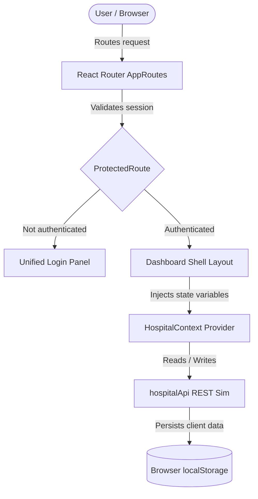

# CurePulse - Smart Hospital Management System

CurePulse is a premium hospital management dashboard built with **React 19**, **Vite 8**, and **Tailwind CSS v4**. It simulates real-time data flow for four distinct user roles, persisting all changes directly to browser `localStorage`.

---

## 🔑 Quick Demo Credentials

Log in with any of the demo profiles below:

| Role | Email | Password | Access Area |
|---|---|---|---|
| **Admin** | `admin@curepulse.com` | `demo123` | Full control: revenue, scheduling, inventory |
| **Doctor** | `doctor@curepulse.com` | `demo123` | Patients list, appointments, AI Diagnostic Assistant |
| **Receptionist** | `receptionist@curepulse.com` | `demo123` | Manage online bookings, registrations, admissions |
| **Patient** | `patient@curepulse.com` | `demo123` | Live telemetry, medication tracking, clinic room |

*Note: You can also register a new patient account using the **Sign Up** tab on the login screen.*

---

## ⚡ Quick Start

### Prerequisites
- **Node.js** >= 18.0.0
- **npm** >= 9.0.0

### Run the App
```bash
# 1. Install dependencies
npm install

# 2. Start the hot-reloading dev server
npm run dev

# 3. Build for production compilation
npm run build
```
Once started, the application runs locally at `http://localhost:5173`.

---

## 🌟 Key Workspaces

- **🏥 Patient Portal**: Check daily pill compliance, symptom checkers, telehealth clinics, relative ECG monitors, and doctor lookup.
- **🥼 Doctor Portal**: View appointments queue, log patient prescriptions, and use the AI clinical summaries and prescription assistants.
- **🛎️ Receptionist Portal**: Fast check-in walk-ins, triage online appointment requests, and manage bed maps.
- **👑 Admin Portal**: Track financial revenue collections, adjust staff shifts, review audit logs, and dispatch emergency alerts.

---

## 📁 Key File Structure

```
src/
├── app/layouts/      # Global Layout Shells (Sidebar, Navbar, Dashboard shell)
├── context/          # React State Providers (Auth, Theme, Hospital Data, Notifications)
├── modules/          # Feature Pages (Dashboard views, login screen panels, landing)
├── routes/           # Router configurations and role-based route guards
└── services/         # Mock API (persists data with 120-240ms network latency simulation)
```

---

## 🔄 Project Data Flow

The following visual diagram tracks how a user request flows from routing to database simulation:



### Simplified Flow Explained:
1. **Authentication Guard**: Visiting a URL passes through a `ProtectedRoute`. The session is verified with `AuthContext`.
2. **Dashboard Shell & Layout**: Logged-in users load `DashboardLayout.jsx`, which wraps the `Sidebar` and dynamic sub-route `Outlet` page contents.
3. **Reactive Global State**: Page actions (like booking a slot or adding a prescription) invoke handlers inside `HospitalContext.jsx`.
4. **Mock API Storage**: State alterations flow to `hospitalApi.js`, simulating database latency, before saving to `localStorage`.
